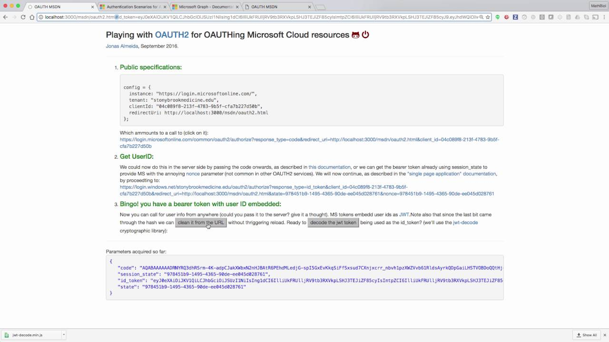

# msdn
Sandbox for interoperability and App development using Microsoft Cloud
___
Live at https://sbm-it.github.io/msdn/oauth2.html, if you have added that domain to the authorized redirects. You can also clone it to your localhost and call it from there too; or from any authorized domain you may have added to the tenant you are using.

A screencast was also recorded for convenience:

